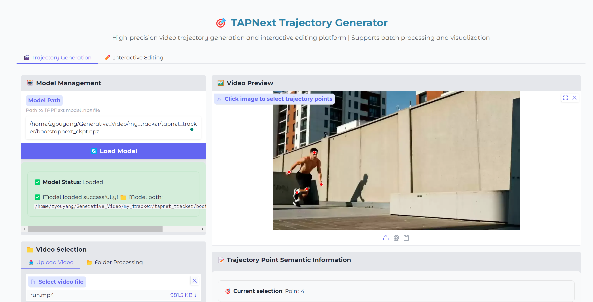
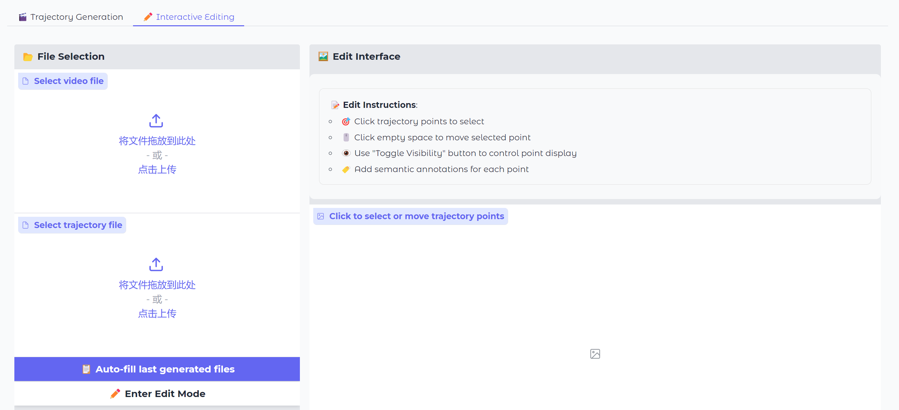

# TAPNet Tracker and Editor | TAPNext轨迹跟踪与编辑器

<div align="center">

🎯 **A comprehensive video point tracking and editing solution using TAPNext model**  
**基于TAPNext模型的综合视频点轨迹跟踪和编辑解决方案**

[](https://python.org)
[](https://jax.readthedocs.io)
[](https://gradio.app)
[](LICENSE)

</div>

---

## 📋 Table of Contents | 目录

- [English](#english)
  - [Overview](#overview)
  - [Features](#features)
  - [Installation](#installation)
  - [Quick Start](#quick-start)
  - [Usage](#usage)
  - [API Reference](#api-reference)
- [中文](#中文)
  - [项目概述](#项目概述)
  - [功能特性](#功能特性)
  - [安装指南](#安装指南)
  - [快速开始](#快速开始)
  - [使用说明](#使用说明)
  - [API参考](#api参考)
- [License | 许可证](#-license--许可证)
- [Acknowledgments | 致谢](#-acknowledgments--致谢)

---

## 📸 Screenshots | 截图

### Main Interface | 主界面


### Interactive Editing | 交互式编辑


---

## English

### Overview

TAPNet Tracker is a video trajectory tracking tool built on the TAPNext model. It provides an intuitive Gradio-based web interface for video analysis, point tracking, and interactive trajectory editing.

**Key Capabilities:**
- 🎥 Video preprocessing and analysis
- 🎯 Automatic and manual point tracking
- 🖼️ Real-time visualization
- ✏️ Interactive trajectory editing
- 📊 Semantic information management
- 🌐 Web-based user interface

### Features

#### Core Tracking
- **Advanced Model**: Based on TAPNext architecture with JAX/Flax implementation
- **High Accuracy**: Precise trajectory tracking with visibility prediction
- **Multi-Point Support**: Track multiple points simultaneously
- **Real-time Processing**: Efficient video processing pipeline

#### Interactive Interface
- **Gradio Web UI**: Modern, responsive web interface
- **Point Selection**: Click-to-select points on video frames
- **Live Preview**: Real-time trajectory visualization
- **Export Options**: Multiple output formats (PTH, JSON, TXT)

#### Advanced Features
- **Edit Mode**: Interactive trajectory correction and refinement
- **Semantic Tagging**: Add meaningful descriptions to tracking points
- **Batch Processing**: Process multiple videos efficiently
- **Customizable Output**: Flexible configuration for different use cases

### Installation

#### Prerequisites
- Python 3.8 or higher
- CUDA-compatible GPU (recommended)
- 8GB+ RAM

#### Install Dependencies

```bash
# Clone the repository
git clone https://github.com/your-username/tapnet-tracker.git
cd tapnet-tracker

# Install required packages
pip install -r requirements.txt
```

### Quick Start

#### 1. Launch the Application
```bash
python main.py
```

#### 2. Access Web Interface
Open your browser and navigate to: `http://localhost:7860`

#### 3. Load Model
- The application will automatically load the TAPNext model checkpoint, whose can be download at [TAPNext](https://storage.googleapis.com/dm-tapnet/tapnext/bootstapnext_ckpt.npz).
- Default model path: `/path/to/tapnet/checkpoints/bootstapnext_ckpt.npz`

#### 4. Process Your First Video
1. Upload or select a video file
2. Click on the video frame to select tracking points
3. Click "Generate Tracks" to start processing
4. View results in the visualization panel

### Usage

#### Basic Workflow

1. **Model Loading**
   ```python
   from tapnet_tracker import TAPNextTracker
   
   tracker = TAPNextTracker()
   success, message = tracker.load_model("path/to/checkpoint.npz")
   ```

2. **Video Processing**
   ```python
   # Scan video folder
   success, info, files = tracker.scan_folder("path/to/videos")
   
   # Process video
   result = tracker.process_video(
       video_choice="video.mp4",
       manual_points=[(100, 150), (200, 250)],
       num_points=32
   )
   ```

3. **Interactive Editing**
   ```python
   from tapnet_tracker.interactive import TrackEditManager
   
   editor = TrackEditManager()
   editor.initialize_edit_mode("video.mp4", "tracks.pth")
   ```

#### Web Interface Guide

**Main Tabs:**
- **Model Loading**: Load and configure the TAPNext model
- **Video Processing**: Select videos and configure tracking parameters
- **Interactive Editing**: Fine-tune trajectories with visual feedback
- **Semantic Management**: Add descriptions and metadata to tracks

**Workflow Steps:**
1. Load model in the "Model Loading" tab
2. Select video and configure parameters in "Video Processing"
3. Use interactive tools for trajectory refinement
4. Export results in desired format

### API Reference

#### Core Classes

**TAPNextTracker**
- `load_model(checkpoint_path)`: Load model from checkpoint
- `scan_folder(folder_path)`: Scan for video files
- `process_video(...)`: Process video with tracking
- `get_video_path_by_choice(choice)`: Get full video path

**TrackEditManager**
- `initialize_edit_mode(...)`: Start interactive editing
- `update_point_coordinates(...)`: Modify point positions
- `toggle_point_visibility(...)`: Change point visibility
- `save_modified_tracks(...)`: Export edited trajectories

**SemanticInfoManager**
- `initialize_semantic_info(...)`: Set up semantic management
- `set_semantic_info(...)`: Add descriptions to points
- `export_semantic_info_to_json()`: Export metadata


---

## 中文

### 项目概述

TAPNet Tracker 是一个基于 TAPNext 模型的先进视频轨迹跟踪工具。它提供了直观的 Gradio 网页界面，用于视频分析、点追踪和交互式轨迹编辑。

**核心能力：**
- 🎥 视频预处理和分析
- 🎯 自动和手动点追踪
- 🖼️ 实时可视化
- ✏️ 交互式轨迹编辑
- 📊 语义信息管理
- 🌐 基于网页的用户界面

### 功能特性

#### 核心追踪功能
- **先进模型**：基于 TAPNext 架构，使用 JAX/Flax 实现
- **高精度**：精确的轨迹追踪和可见性预测
- **多点支持**：同时追踪多个点
- **实时处理**：高效的视频处理流水线

#### 交互界面
- **Gradio 网页界面**：现代化、响应式的网页界面
- **点选择**：在视频帧上点击选择追踪点
- **实时预览**：实时轨迹可视化
- **导出选项**：多种输出格式（PTH、JSON、TXT）

#### 高级功能
- **编辑模式**：交互式轨迹校正和优化
- **语义标注**：为追踪点添加有意义的描述
- **批量处理**：高效处理多个视频
- **自定义输出**：针对不同用例的灵活配置

### 安装指南

#### 环境要求
- Python 3.8 或更高版本
- 兼容 CUDA 的 GPU（推荐）
- 8GB+ 内存

#### 安装依赖

```bash
# 克隆仓库
git clone https://github.com/your-username/tapnet-tracker.git
cd tapnet-tracker

# 安装所需包
pip install -r requirements.txt
```

### 快速开始

#### 1. 启动应用
```bash
python main.py
```

#### 2. 访问网页界面
在浏览器中打开：`http://localhost:7860`

#### 3. 加载模型
- 应用会自动加载 TAPNext 模型检查点, 可以在[TAPNext](https://storage.googleapis.com/dm-tapnet/tapnext/bootstapnext_ckpt.npz)下载。
- 默认模型路径：`/path/to/tapnet/checkpoints/bootstapnext_ckpt.npz`

#### 4. 处理您的第一个视频
1. 上传或选择视频文件
2. 在视频帧上点击选择追踪点
3. 点击"生成轨迹"开始处理
4. 在可视化面板中查看结果

### 使用说明

#### 基本工作流程

1. **模型加载**
   ```python
   from tapnet_tracker import TAPNextTracker
   
   tracker = TAPNextTracker()
   success, message = tracker.load_model("path/to/checkpoint.npz")
   ```

2. **视频处理**
   ```python
   # 扫描视频文件夹
   success, info, files = tracker.scan_folder("path/to/videos")
   
   # 处理视频
   result = tracker.process_video(
       video_choice="video.mp4",
       manual_points=[(100, 150), (200, 250)],
       num_points=32
   )
   ```

3. **交互式编辑**
   ```python
   from tapnet_tracker.interactive import TrackEditManager
   
   editor = TrackEditManager()
   editor.initialize_edit_mode("video.mp4", "tracks.pth")
   ```

#### 网页界面指南

**主要标签页：**
- **模型加载**：加载和配置 TAPNext 模型
- **视频处理**：选择视频并配置追踪参数
- **交互式编辑**：通过可视化反馈精调轨迹
- **语义管理**：为轨迹添加描述和元数据

**工作流程步骤：**
1. 在"模型加载"标签页中加载模型
2. 在"视频处理"中选择视频并配置参数
3. 使用交互工具进行轨迹优化
4. 以所需格式导出结果

### API参考

#### 核心类

**TAPNextTracker**
- `load_model(checkpoint_path)`：从检查点加载模型
- `scan_folder(folder_path)`：扫描视频文件
- `process_video(...)`：处理视频追踪
- `get_video_path_by_choice(choice)`：获取完整视频路径

**TrackEditManager**
- `initialize_edit_mode(...)`：启动交互式编辑
- `update_point_coordinates(...)`：修改点位置
- `toggle_point_visibility(...)`：改变点可见性
- `save_modified_tracks(...)`：导出编辑后的轨迹

**SemanticInfoManager**
- `initialize_semantic_info(...)`：设置语义管理
- `set_semantic_info(...)`：为点添加描述
- `export_semantic_info_to_json()`：导出元数据


---
## 🛠️ Technical Details | 技术细节

### Architecture | 架构
- **Frontend**: Gradio web interface
- **Backend**: JAX/Flax model implementation
- **Processing**: OpenCV video handling
- **Visualization**: Matplotlib and custom rendering
---
## 🙏 Acknowledgments | 致谢

- TAPNet team for the original model architecture
- JAX/Flax community for the framework
- Gradio team for the excellent web interface framework

---
<div align="center">

**⭐ Star this repository if you find it helpful! | 如果您觉得有用，请给仓库点个星！**


</div> 